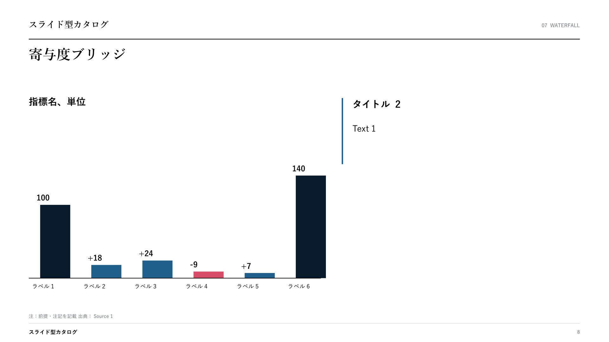
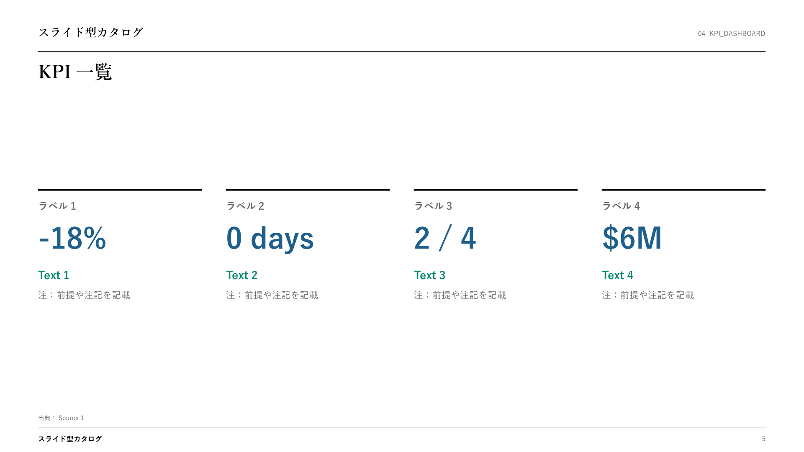
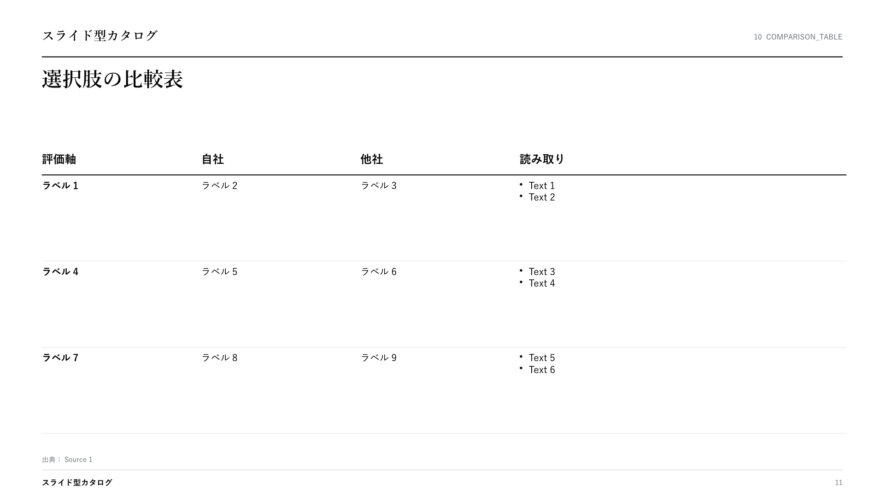

# consulting-pptx-skill

**AIに「まじな」のPowerPointを作らせるためのClaude Codeスキル。**
スライド作成規約（約85項目）＋機械チェック＋**自由記述パーツ集27パーツ**＋コンサル型スライド36型のSlideSpec（JSONによるスライド定義）＋生成パイプライン（HTMLプレビュー→編集可能PPTX）の一式です。

A Claude Code skill for generating boardroom-quality decks: a 27-part freeform HTML parts library, a catalog of 36 consulting slide archetypes with a JSON SlideSpec format, a render pipeline (HTML preview → natively editable PPTX), a slide-design rulebook, and an automated rule checker.

私たちが実際に毎週の提案書・報告書づくりで使っている仕組みの公開版です。解説記事はこちら → [AIにまじなスライド作らせる（note）](https://note.com/jinbaflow/n/nc8372b84e572)

## 本質は `references/slide-rules.md`（約80項目のスライド規約）

このリポジトリでいちばん価値があるのは、実はテンプレでもスクリプトでもなく、**[slide-rules.md](references/slide-rules.md)** というテキストファイルです。実務の資料レビューで受けた指摘を1行ずつ書き溜めた約80項目 — 「結論はタイトルに書く」「角丸禁止」「塗りのあるボックスに枠線を付けない」「1資料1用語」…。

使い方はシンプルで、**AIに資料を作らせる前に毎回このファイルを読ませ、出力後に `scripts/check_deck.py` で違反を機械検出し、最後に `references/content-review-prompt.md` で作り方を伏せた別エージェントに内容の矛盾を拾わせる**だけ。AIはセッションごとに記憶がリセットされるので、口頭で注意しても定着しません。ルールをファイル化して毎回読ませるのが唯一の定着方法です。

そして、良いスライドを作るのは型ではなく**流し込んだ後の調整**です。表を2枚に割る、右カラムを帰結形に書き直す、タイトルの通し読みでストーリーを繋ぎ直す — 型に囚われず考えて直し、そこで受けた指摘をまた slide-rules.md に1行追記する。この蓄積ループが品質の源泉で、36型テンプレとパイプラインは「たたき台を数十秒で出して、調整の反復回数を稼ぐ」ための道具にすぎません。

自社で使うときは、slide-rules.md に自社の規約・指摘を追記して育ててください。

## 作り方は2経路、型カタログは1本

| 経路 | 実体 | 出せるもの | 使うとき |
| --- | --- | --- | --- |
| **自由記述（本線）** | `templates/freeform_parts_16x9.html`（27パーツ） | HTMLデッキ → PDF | 納品物。主張に合わせて1枚ずつ組む |
| **SlideSpec パイプライン** | `pipeline/slide-spec/super_template.json`（36型） | **編集可能なPPTX** | たたき台を秒で出す・PowerPointで渡す |

どちらの型も **タイトル欄は型名だけ**で、見本の主張文は置いていません。見本文があると文型がそのまま真似され、主張ではなくテンプレを写した資料になるからです（slide-rules §2.8）。タイトルは必ずストーリーラインから起こして差し替えます。

プレースホルダーの書き方は両経路で統一しています: 本文 `Text 1`、項目名 `ラベル 1`、見出し `タイトル 1`、数値 `00`、年 `YYYY年`、指標行 `指標名、単位、YYYY〜YYYY年`、出典 `出典：Source 1`。`check_deck.py` はこれらが納品デッキに残っていたら **FAIL**、タイトルの文型が6割以上同じなら **WARN** にします（テンプレ集そのものを検査するときだけ `--template`）。

パーツ集の主なもの: 主張パネル＋図／打ち手の効果表／状態ヒートマップ／充足度評価表（ハーベイボール）／割合のドットマトリクス／進捗バブル行列／分布の順位棒／注記つき散布図／柱＋土台／対向シェブロン／外部動向の根拠グリッド／比例円の対比／増減の縦棒／シナリオ線＋成長率チップ／調査の土台／課題と打ち手の2カラム／セパレーター（章扉＝アジェンダ再掲・現在地を強調）。

## たたき台を秒で出す仕組み（36型×SlideSpec）

核心は「**AIにレイアウトを描かせない**」こと。36型それぞれのレイアウト（タイトル位置・余白・フォントサイズ・作図ルール）は実測値としてレンダラーに焼き込んであり、AIが書くのは中身（主張・数値・ラベル）だけです。

このJSON（SlideSpec）を書くと——

```json
{
  "template": "waterfall",
  "kicker": "07｜収益ブリッジ",
  "title": "営業利益は価格改定と歩留まり改善で+42を積み、為替の逆風を吸収して140に着地する",
  "chart": {
    "unit": "億円",
    "series": [
      { "label": "FY24実績", "value": 100, "kind": "base" },
      { "label": "価格改定", "value": 18, "kind": "up" },
      { "label": "歩留まり改善", "value": 24, "kind": "up" },
      { "label": "為替影響", "value": -9, "kind": "down" },
      { "label": "その他", "value": 7, "kind": "up" },
      { "label": "FY25見込", "value": 140, "kind": "total" }
    ]
  },
  "sections": [ { "title": "含意", "copy": "寄与の6割は価格改定。為替の逆風は想定レンジ内で吸収できる" } ],
  "note": "注：FY25は10月時点の着地見込",
  "source": "出典：社内管理会計"
}
```

——この1枚が出てきます。



ほかの例（`pipeline/slide-spec/example_deck.json` に3枚分を同梱）:

| kpi_dashboard | comparison_table |
| --- | --- |
|  |  |

## セットアップ

```bash
# Claude Codeのスキルフォルダにcloneするだけ
git clone https://github.com/gozen3ji/consulting-pptx-skill.git ~/.claude/skills/consulting-pptx-skill

# パイプラインの初期化（Node.jsが必要。playwright chromiumも入ります）
cd ~/.claude/skills/consulting-pptx-skill/pipeline
npm run setup
```

あとはClaude Codeにこう頼みます:

> 新規事業の投資判断資料を作りたい。36型から型を選んで10枚構成のSlideSpecを書き、パイプラインで編集可能なPPTXまで出して。作成前に slide-rules.md を読み、出力後は check_deck.py でFAIL 0にすること。

## 手動で使う場合

```bash
cd pipeline
node scripts/validate_spec.mjs slide-spec/example_deck.json                              # スキーマ検証
node scripts/render_spec_to_html.mjs slide-spec/example_deck.json generated/deck.html    # HTMLプレビュー
node scripts/qa_html_deck.mjs generated/deck.html                                        # 構造QA
node scripts/export_spec_to_editable_pptx.mjs slide-spec/example_deck.json generated/deck.pptx  # 編集可能PPTX
python3 ../scripts/check_deck.py generated/deck.pptx                                     # 規約の機械チェック
node ../scripts/check_layout.mjs generated/deck.html                                     # HTMLのはみ出し・重なり検査
```

自由記述で組むときは `templates/freeform_parts_16x9.html` をコピーして不要な `<section>` を消し、プレースホルダーを差し替えてから同じ `check_deck.py` にかけます。

書き出されるPPTXは画像貼り付けではなく、全図形がPowerPointで編集できるネイティブなテキストボックス・表・シェイプです。

## 中身

| パス | 内容 |
| --- | --- |
| `SKILL.md` | 実運用フロー＋36型カタログ（AIへの指示書。これがスキルの本体） |
| `templates/freeform_parts_16x9.html` | 自由記述パーツ集（27パーツ・1パーツ=1スライド・16:9）。本線の作り方 |
| `pipeline/` | 生成スクリプト（validate / render / qa / export / shots）＋CSS |
| `pipeline/slide-spec/super_template.json` | 36型すべての完成SlideSpec定義（コピーして使う正本） |
| `pipeline/slide-spec/example_deck.json` | 記入例3枚（上のプレビュー画像の元データ） |
| `pipeline/slide-spec/schema.json` | SlideSpecスキーマ |
| `references/slide-rules.md` | スライド作成ルール正典（約80項目） |
| `references/content-review-prompt.md` | 内容レビューの指示文。機械チェックのあと、作り方を伏せた別エージェントに全ページを読ませ、タイトルと図の食い違い・根拠のない評価語・既出ページの焼き直しを拾う |
| `scripts/check_deck.py` | 規約の機械チェック（PPTX / HTML両対応。要 `pip3 install python-pptx`。テンプレ集の検査は `--template`）。タイトルの「N段階」と本文の連番の食い違いも FAIL にする |
| `scripts/check_layout.mjs` | HTMLデッキの実レンダリング検査（フッターとの重なり・右端/下端のはみ出し） |
| `assets/SuperTemplate_36type.pptx` | おまけ: 36型を1枚ずつ収めた見本帳PPTX（[PDF版](assets/SuperTemplate_36type.pdf)） |

Node.jsが無い環境でも、見本帳PPTXの手動コピペとルール正典・機械チェックはそのまま使えます。

## カスタマイズ

- **いちばん効くのは slide-rules.md への追記**です。レビューで受けた指摘を1行ずつ足していくと、御社専用の資料作成AIに育ちます
- SlideSpecルートの `palette` でブランドカラーを一括差し替えできます（`schema.json` 参照）

## About

Made by [Carnot AI](https://jinba.io) — AIエージェント基盤「Jinba」を開発・提供しています。
このスキルと同じ仕組みを、ブラウザのチャットだけで使える形（Jinba App Neo）でも提供しています。

## License

MIT
